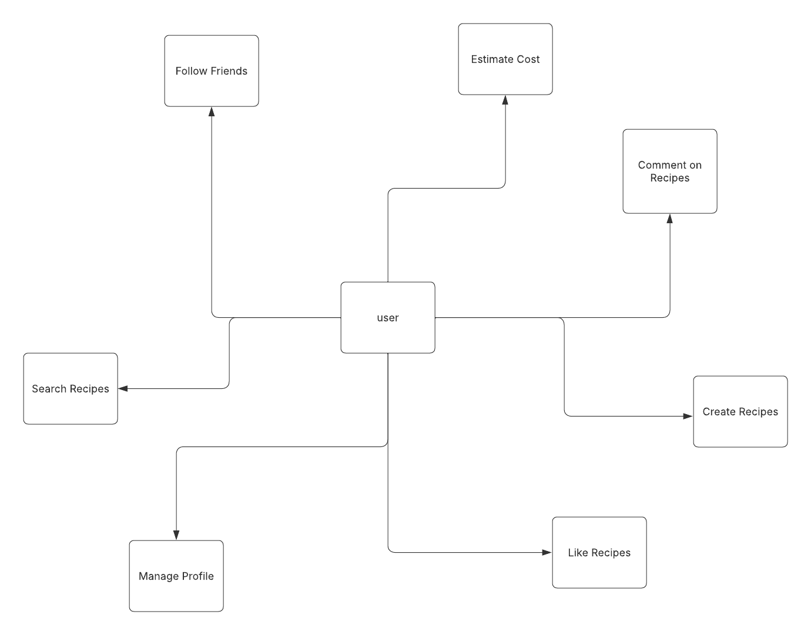

# YumBoard

# General Information

>[!note]
>- Team Number: 016-1
>- Team Name: **YumBoard Dev**
>- Team Members: 
>   - José Camacho Guadamuz 
>   - Aryaman Singh
>   - Jason Gao 
>   - Dresden Friar
>   - Jackson Vondemkamp 
> 

Application Name: **YumBoard**

Application Description:
- YumBoard is a social media app designed to allow anyone to see recipes their friends are making, and share their own culinary creations. It features a built-in grocery list which interfaces with shared recipes, and can give you an estimate of cost for your grocery list. 

Audience:
- College students who want to cook at home more, but are tight on time/lack experience. YumBoard will make cooking and grocery shopping both easier and faster for everyone. 

Vision Statement:
- To make cooking and grocery shopping effortless and social for busy college students.

Development Methodology:
- Agile

Communication Plan:
-  We plan to use a discord server with several specific, dedicated channels. 

Meeting Plan:
- **TA Meeting**: We are going to meet on Tuesdays at 2pm every week. 
- **Team Meeting**: We are going to meet as a team directly after our meeting with the TA (at 2:15pm)

# Use Case Diagram:

# Wireframe:

